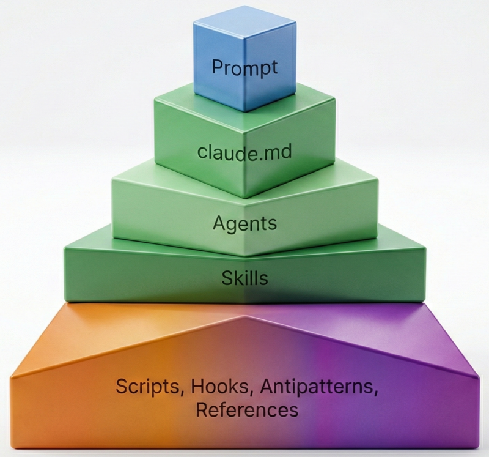

# AI Context Engineering for QA

🎤 Presented at "Podlodka AI Crew #2" in 2026 — [Watch Demo](https://youtu.be/7VnjM44qkmc) / [Slides](presentation/Workshop_AI_for_QA.pdf)

A ready-to-use collection of AI prompts, agents, and anti-patterns for several QA workflows including automation API tests.

Structured prompts give more consistent results than ad-hoc chat — each skill in this repo is a tested `.md` file that tells the AI exactly what to do, 
what to check, and how to format the output. Originally built for a workshop, works as a standalone toolkit (should be adapted for your specific needs).

Disclaimer: I insist that you have to review any AI generated results even if it used great prompts/agents/skills and looks pretty nice.

<p align="center">
  
</p>

---

## 🚀 Getting Started

### 1. Pick your tool

| Tool              | Setup method        | Context loading                                     |
|-------------------|---------------------|-----------------------------------------------------|
| 🟣 Claude Code    | Native              | Automatic: `CLAUDE.md` → `qa_agent.md` → `SKILL.md` |
| 🟢 OpenCode       | Native              | Automatic: `CLAUDE.md` → `qa_agent.md` → `SKILL.md` |
| ⚪️ Cursor         | MDC Rules           | via `.cursor/rules/*.mdc`                           |
| 🔵 GitHub Copilot | Custom Instructions | via `.github/copilot-instructions.md`               |
| 🟤 Codex          | Agent Skills        | via `AGENTS.md` + `.agents/skills/`                 |

<details>
<summary>👇 <strong>Full compatibility matrix — click to expand</strong> 👇</summary>

| Capability         | 🟣 Claude Code | 🟢 OpenCode  | ⚪️ Cursor               | 🔵 VS Code Copilot          | ⚫️ IntelliJ Copilot         | 🟤 Codex            | 💬 Generic Chat |
|--------------------|----------------|--------------|-------------------------|-----------------------------|-----------------------------|---------------------|-----------------|
| **File mapping**   |                |              |                         |                             |                             |                     |                 |
| `CLAUDE.md`        | **Native** ✓   | **Native** ✓ | **Native** ✓            | → `copilot-instructions.md` | → `copilot-instructions.md` | → `AGENTS.md`       | 📋 Copy-paste   |
| `qa_agent.md`      | **Native** ✓   | **Native** ✓ | → `.cursor/rules/*.mdc` | → `copilot-instructions.md` | → `copilot-instructions.md` | → `AGENTS.md`       | 📋 Copy-paste   |
| `skills/*.md`      | **Native** ✓   | **Native** ✓ | → `.cursor/rules/*.mdc` | **Native** ✓                | Open in editor              | → `.agents/skills/` | 📋 Copy-paste   |
| Plugins            | ✅              | ❌            | ❌                       | ❌                           | ❌                           | ✅                   | ❌               |
| Anti-patterns      | ✅              | ✅            | ✅                       | ✅                           | ✅                           | ✅                   | 📋 Copy-paste   |
| **Workshop steps** |                |              |                         |                             |                             |                     |                 |
| 1. Analysis        | 🟢             | 🟢           | 🟢                      | 🟡                          | 🟡                          | 🟢                  | 🔴              |
| 2. Test cases      | 🟢             | 🟢           | 🟢                      | 🟡                          | 🟡                          | 🟢                  | 🔴              |
| 3. API tests       | 🟢             | 🟢           | 🟢                      | 🟡                          | 🟡                          | 🟢                  | 🔴              |
| 4. UI & L10N       | 🟢             | 🟢           | 🟢                      | 🟡                          | 🔴                          | 🟢                  | 🔴              |

> 🟢 native — 🟡 file reference — 🔴 not supported

> **Disclaimer:** Tools other than Claude Code may consume higher token usage — check token usage for any skill.
> If significant, use the native file structure per official documentation (links below).

</details>

### 2. Installation

- **For Claude Code / OpenCode:** Copy the `.claude/` folder from this repo into your project root. Then run `/init-project` in your AI chat to automatically generate your `CLAUDE.md` config.
- **For other IDEs:** Check the compatibility matrix above to see how to load the context properly.

### 3. Run your first audit

Open your AI chat and follow the [QA Workflow Skills](#-qa-workflow-skills) pipeline below.

> 📖 Detailed prompt snippets for every IDE: **[docs/workshop-commands.md](docs/workshop-commands.md)**

---

## 🏗️ Setup Skills

Generate and maintain the AI configuration files themselves.

| Skill           | What it generates                                | When to use                      |
|-----------------|--------------------------------------------------|----------------------------------|
| `/init-project` | `CLAUDE.md` — project-level AI instructions      | New QA project, no AI config yet |
| `/init-agent`   | `qa_agent.md` — QA agent role and principles     | Setting up AI agent behavior     |
| `/init-skill`   | `SKILL.md` — new skill with checklist and phases | Automating a repeatable QA task  |

## 🔬 QA Workflow Skills

Core pipeline — choose your starting point based on the scope:

```text
[Macro] /repo-scout (whole repo)  ──┐
                                    ↓
[Micro] /spec-audit (single spec)  ──→  audit/spec-audit_{date}.md
                                    ↓
         /test-cases               ──→  docs/test-cases/test-scenarios.md
                                    ↓
         /api-tests                ──→  src/test/kotlin/...Tests.kt
```

| Skill         | Input                          | Output                                              | What you'll see                                    |
|---------------|--------------------------------|-----------------------------------------------------|----------------------------------------------------|
| `/repo-scout` | Backend repository             | API surface, infrastructure, test coverage map      | Catalog of endpoints, gaps, entry points for tests |
| `/spec-audit` | API specification              | QA audit report: gaps, contradictions, OWASP issues | ~15 defects, PO questions, risk matrix             |
| `/test-cases` | Specification + audit          | Exhaustive test scenario matrix (Markdown)          | Markdown table: ~50–80 test scenarios per spec     |
| `/api-tests`  | Test scenarios + specification | Production-ready Kotlin tests (JUnit 5, Allure)     | Kotlin test class, ready to run: `./gradlew test`  |

---

## 🧰 Other Skills

| Skill                 | Purpose                                                                            |
|-----------------------|------------------------------------------------------------------------------------|
| `/screenshot-analyze` | Analyze mobile screenshots for UI & L10N defects (translations, CLDR formats, RTL) |
| `/doc-lint`           | Documentation quality audit — structure, duplicates, SSOT violations               |
| `/skill-audit`        | Audit SKILL.md files for bloat, duplication, and harmful patterns                  |
| `/output-review`      | Independent audit of any skill's output against its checklist                      |
| `/agents-checker`     | Verify structural integrity of agent files                                         |

---

## 🏛️ Project Patterns

- **Progressive Disclosure** — `CLAUDE.md` → `qa_agent.md` → `SKILL.md` load only on demand, saves tokens
- **Gardener Protocol** — AI suggests improvements to the knowledge base at the end of each run
- **Quality Gates** — more than 20 anti-pattern files the AI checks generated code against
- **Meta Configuration** — `/init-*` skills generate and maintain the config files themselves
- **Token Management** — specialized agents (Auditor, SDET) and strict context limits prevent context window bloat

> Full inventory of approaches and files: [docs/ai-setup.md](docs/ai-setup.md)

---

## ⚙️ Tech Stack (for generated tests)

| Component      | Technology             |
|----------------|------------------------|
| Language       | Kotlin                 |
| Test Framework | JUnit 5                |
| HTTP Client    | ktor-client (CIO)      |
| Serialization  | Jackson                |
| Assertions     | Kotest assertions-core |
| Reporting      | Allure                 |

---

## 📄 Workshop Materials

- 📺 [Demo Video](https://youtu.be/7VnjM44qkmc) — Live session: AI-Driven QA with Claude
- 📊 [Presentation (PDF)](presentation/Workshop_AI_for_QA.pdf)
- 📖 [Workshop commands & IDE prompts](docs/workshop-commands.md)
- 🔀 Branches: `main` (configured project), `spec-only` (clean starting point)

---

## 📚 Resources

### 🧠 Prompt Engineering

- [Anthropic Prompt Guide](https://docs.anthropic.com/en/docs/build-with-claude/prompt-engineering/overview)

### 🟣 Anthropic (Claude)

- [Anthropic Cookbook](https://github.com/anthropics/anthropic-cookbook)
- [The Complete Guide to Building Skills for Claude (PDF)](https://resources.anthropic.com/hubfs/The-Complete-Guide-to-Building-Skill-for-Claude.pdf?hsLang=en)
- [Sub-agents](https://code.claude.com/docs/en/sub-agents)

### 🔵 VS Code & GitHub Copilot

- [Custom Instructions](https://code.visualstudio.com/docs/copilot/customization/custom-instructions) — configuring `.github/copilot-instructions.md`

### 🔵 Cursor

- [Skills](https://cursor.com/docs/context/skills)
- [Subagents](https://cursor.com/docs/context/subagents)

### 🔵 Codex

- [Agent Skills](https://developers.openai.com/codex/skills/)

### 🧠 Vibe Coding

- [Vibe coding tips](https://www.threads.com/@boris_cherny/post/DTBVlMIkpcm)

### 🌐 Translations

- [Translated version of this repository (ru)](https://github.com/vlad-ryzhkov/AI-QA-workshop-feb19)

