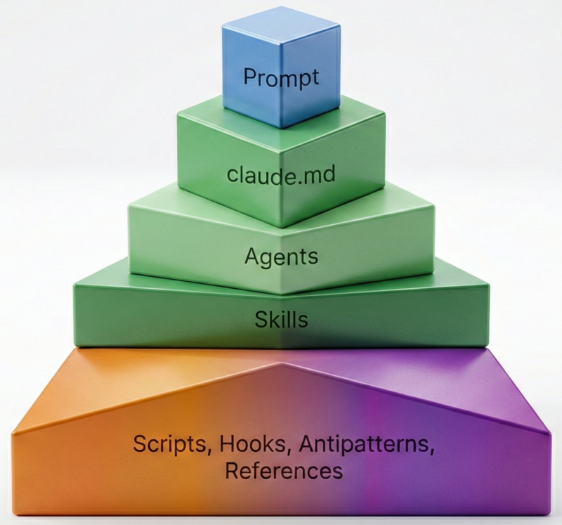

# AI Context Engineering for QA

Stop writing ad-hoc prompts. Engineer the context instead.

A working library of **22 AI skills** for QA work — reusable instruction files that tell an AI
assistant exactly how to audit a specification, generate test cases, write API tests in Kotlin or
Java, and review its own output — plus **31 anti-pattern quality gates** the assistant checks its
output against before it finishes.

Copy `.claude/` into your project and the assistant knows how to do QA work in it.

<p align="center">
  
</p>

---

## Why this exists

An AI assistant can write your API tests, audit your specs, and review your code — but only with
the right instructions. Without context it starts from zero every conversation: it picks whatever
library it saw most in training, ignores your standards, and produces output you rewrite by hand.

This repository is what a year of fixing that looks like: field-tested instructions, the design
decisions behind them, and honest notes on the parts that did not work.

It started as material for one workshop. It is now the author's working portfolio of skill and
context engineering. Corporate skills are deliberately not here.

---

## Quick start

1. **Copy** `.claude/` into your backend or QA project root.
   Not using Claude Code? See [docs/adapting-to-other-tools.md](docs/adapting-to-other-tools.md).

2. **Write `CLAUDE.md` by hand** — tech stack, build and test commands, banned alternatives. Nothing
   else. Research shows hand-written context files beat AI-generated ones, and bloated ones actively
   *reduce* success rate while raising cost by over 20%. Guidelines:
   [docs/claudemd-instructions.md](docs/claudemd-instructions.md).

3. **Run a skill.** Start by scanning a backend repo:

   ```text
   /repo-scout
   ```

   You get a structured report: endpoints found, tech stack detected, coverage gaps, and a blueprint
   for generating tests.

> **New to this?** Start on the [`spec-only` branch](../../tree/spec-only) — API specifications only,
> no pre-generated code, so you can walk the whole pipeline yourself.

---

## The skills

**[`SKILLS.md`](SKILLS.md) is the single source of truth** — all 22 skills, grouped, each with a
status. Nothing else in this repo keeps a second list.

The core pipeline:

```text
/repo-scout    →  /spec-audit   →  /api-test-cases  →  /api-tests    →  /api-test-review
(backend repo)    (find spec       (scenario matrix)   (Kotlin or       (security,
                   contradictions)                      Java tests)      architecture)
```

| Skill              | Input                 | Output                                        |
| ------------------ | --------------------- | --------------------------------------------- |
| `/repo-scout`      | Backend repository    | API surface map, coverage gaps, test blueprint |
| `/spec-audit`      | Specification         | Audit report — contradictions, gaps, risks     |
| `/api-test-cases`  | Specification + audit | Test scenario matrix for all endpoints         |
| `/api-tests`       | Scenarios + spec      | Kotlin tests (JUnit 5, ktor-client, Allure)    |
| `/api-tests-java`  | Scenarios + spec      | Java 17+ tests (JUnit 5, AssertJ, Allure)      |
| `/api-test-review` | Test code + spec      | Review report with severity levels             |

For an existing test suite, skip generation: `/repo-scout` → `/api-test-cases` (gap analysis) →
`/api-test-review` (legacy audit and contract check) → `/api-tests fix` (surgical fixes, no
regeneration).

### What the output looks like

`/spec-audit` on a registration API — it reads the spec adversarially rather than trusting it:

```text
Spec Audit — Registration API v1
Verdict: BLOCKED | Score: 0%

Top 3 Risks:
1. [BLOCKER]  Spec declares 2FA via SMS but the phone field is absent from the request body
2. [CRITICAL] No HTTP Responses section — no success code, no error codes
3. [CRITICAL] Example payload violates Business Rule 3 (password contains "Alex")
```

`/api-test-review` on generated tests:

```text
🔴 CRITICAL: Thread.sleep(2000) in RegistrationIdempotencyTests.kt:45
   Fix: replace with runTest { advanceTimeBy(2.seconds) }

🟠 MAJOR: Missing Content-Type assertion in RegistrationPositiveTests.kt:28
   Fix: response.contentType() shouldBe ContentType.Application.Json
```

A real scenario matrix generated during the workshop:
[`workshop-podlodka-ai-crew-2/example-test-scenarios.md`](workshop-podlodka-ai-crew-2/example-test-scenarios.md).

> **Always review AI output.** Well-engineered prompts raise the floor; they do not remove the need
> for a human to validate anything before it merges or runs.

---

## Repository layout

| Path | What it is |
| ---- | ---------- |
| [`SKILLS.md`](SKILLS.md) | Every skill, grouped, with status. The single source of truth |
| [`.claude/skills/`](.claude/skills/) | The skills themselves, flat, one directory each |
| [`.claude/qa-antipatterns/`](.claude/qa-antipatterns/) | 31 quality gates the assistant checks generated code against |
| [`.claude/qa_agent.md`](.claude/qa_agent.md) | The QA role: pipeline, gates, retry policy |
| [`docs/patterns.md`](docs/patterns.md) | The design decisions and why each one exists |
| [`docs/adapting-to-other-tools.md`](docs/adapting-to-other-tools.md) | Running these skills outside Claude Code |
| [`docs/context-budget.md`](docs/context-budget.md) | Token caps for the always-loaded context |
| [`scripts/`](scripts/) | Git hooks, the context budget checker, the cost-rate reporter |
| [`workshop-podlodka-ai-crew-2/`](workshop-podlodka-ai-crew-2/README.md) | Materials from the February 2026 workshop |
| [`in-progress/`](in-progress/README.md) | Unfinished experiments, wired into nothing |
| [`archive/`](archive/README.md) | What was removed, and why |

Skills sit flat in `.claude/skills/` on purpose: **Claude Code does not scan category
subdirectories**, so grouping them into folders would make them undiscoverable. The grouping is in
`SKILLS.md` instead.

---

## Two tools worth running

```bash
python3 scripts/context-check.py      # is your always-loaded context over budget?
python3 scripts/ai-efficiency.py      # $ per 1M tokens, by day / week / month
```

`ai-efficiency.py` reports a *rate*, never a total. Absolute spend tracks how much you worked; the
rate tracks how well your setup reuses context, because it falls as more of the context arrives as
cache reads instead of fresh input.

---

## Adapt it

This is a starting point, not a product.

1. Run a skill and read the output. Expect gaps on the first try.
2. Edit the `.md` file. Skills are natural language — add your team's requirements, delete noise, or
   ask the assistant to improve the instructions directly.
3. Audit what you changed: `/skill-audit` for one skill, `/improve-project-context` for the whole
   corpus.
4. Once the results are consistently good, share the files with your team.

Contributing, quality requirements, and the git hooks: [`CONTRIBUTING.md`](CONTRIBUTING.md).

---

## Tech stack of generated tests

**Kotlin** (`/api-tests`, default): JUnit 5 · ktor-client (CIO) · Jackson · Kotest assertions ·
Allure

**Java 17+** (`/api-tests-java`, opt-in): JUnit 5 · `java.net.http.HttpClient` · Jackson · AssertJ ·
Awaitility · Allure

Both stacks are locked with an explicit banned-alternatives list in `CLAUDE.md` — see
[pattern 6](docs/patterns.md#6-locked-tech-stack-with-an-explicit-banned-column) for why naming the
banned option matters.

---

## Related projects

- **[vigiles](https://github.com/zernie/vigiles)** — grades an agent harness A–F and lints it for
  the failures markdown validation misses: subagents listing tools that do not exist, skills with
  descriptions so similar the model fires the wrong one, rules documented in prose but enforced
  nowhere. A friendly project: this repository is audited with it, and the author contributes
  upstream. See [Harness verification](#harness-verification) below.
- **[anthropics/skills](https://github.com/anthropics/skills)** — the official skill library,
  including `skill-creator`. Compared against `/init-skill` in
  [docs/patterns.md](docs/patterns.md#init-skill-versus-the-official-skill-creator).
- **[mattpocock/skills](https://github.com/mattpocock/skills)** — small, composable, well-documented
  skills for general engineering work; a good model for how to write one.

### Harness verification

```bash
npx vigiles audit      # grade this harness A-F, read-only, no setup
npx vigiles lint       # structural validity and dangling references
```

Current grade: **B (82/100)** — Truthfulness 100, Triggering 100, Structure 100,
Safety 82. Reorganising this repository took it from D (62): the fixes were a
dangling bundled-resource reference, an over-long skill description that buried
its own trigger signal, a `disallowed-tools:` fence on all 22 skills, and an
egress fence on `Bash`.

**Known residual risk, and the honest limit of the fix.** Thirteen skills still
hold all three legs of the "lethal trifecta" — read local data, reach the
network, run commands — so a prompt injection in a spec or a test file could in
principle exfiltrate something. Those thirteen need `Bash` for `./gradlew`,
`wc`, `npx`, `gh`, or `python3`, and any interpreter can open a socket without
naming a blocked binary. No allowlist of command names is airtight while those
skills work at all.

What is in place: nine skills deny `Bash` outright, a settings deny list covers
the egress binaries, and `.claude/hooks/no-egress.sh` inspects every `Bash`
command and blocks the ones whose job is moving bytes off the machine — catching
quoted names, a second command after `&&`, and `openssl s_client` that a glob
pattern misses (20 test cases in `.claude/hooks/no-egress.test.sh`).

That raises the cost of the casual path; it is not a containment boundary, and
the audit score does not credit it, because `vigiles` scores declared tool
fences rather than hooks. Full reasoning:
[docs/patterns.md § Egress fence](docs/patterns.md#19-egress-fence).

> **Gotcha worth knowing:** `disallowed-tools` must be **comma-separated** (or a
> YAML list) for vigiles to parse it. Claude Code also accepts space-separated,
> so `disallowed-tools: WebFetch WebSearch Bash` works at runtime but audits as
> closing nothing. Measured here: switching one skill from spaces to commas moved
> the Safety score with no other change. Reported upstream as
> [zernie/vigiles#217](https://github.com/zernie/vigiles/issues/217) with the
> root cause and a paren-aware tokenizer.

---

## Workshop & demo

- [Demo video](https://youtu.be/7VnjM44qkmc) — presented at Podlodka AI Crew #2, February 2026
- [Workshop materials](workshop-podlodka-ai-crew-2/README.md) — slides, live commands, model
  comparison notes
- Branches: `main` (configured project with generated tests), `spec-only` (clean starting point)

<details>
<summary><strong>Further reading</strong></summary>

**Prompt & skill engineering**

- [Anthropic prompt engineering guide](https://docs.anthropic.com/en/docs/build-with-claude/prompt-engineering/overview)
- [The Complete Guide to Building Skills for Claude (PDF)](https://resources.anthropic.com/hubfs/The-Complete-Guide-to-Building-Skill-for-Claude.pdf?hsLang=en)
- [Anthropic cookbook](https://github.com/anthropics/anthropic-cookbook)
- [Claude Code skills documentation](https://code.claude.com/docs/en/skills)
- [Sub-agents](https://code.claude.com/docs/en/sub-agents) — and
  [why this repo stopped using them](archive/agents/README.md)

**Other tools**

- [VS Code custom instructions](https://code.visualstudio.com/docs/copilot/customization/custom-instructions)
- [Cursor skills](https://cursor.com/docs/context/skills)
- [Codex agent skills](https://developers.openai.com/codex/skills/)

**Translations**

- [Russian version of this repository](https://github.com/vlad-ryzhkov/AI-QA-workshop-feb19)

</details>

---

## Licence

[MIT](LICENSE).
