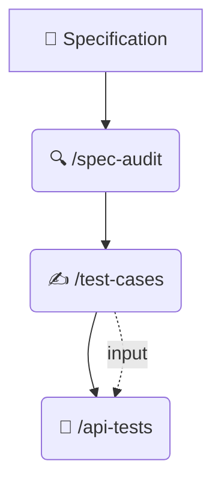

# Command Reference (Cheatsheet)

Prompts for demo. IDE setup — in the Adaptation section of README.md

## 🔄 Quality Pipeline Logic

We build a linked chain of artifacts. The result of each step becomes the foundation for the next. Do not skip file generation steps!



---

> IDE support matrix — see [README.md — Adapting to Your Environment](../README.md#-adapting-to-your-environment)

---

## Precondition

Switch to the branch without AI setup:

```bash
git checkout spec-only
```

> **Context:** empty repository — no `CLAUDE.md`, `qa_agent.md`, `SKILL.md`.

In free form via a chat prompt, ask to generate API tests:

```text
You are a Senior QA Engineer, generate API tests in Kotlin + JUnit
for requirements from file specifications/specifications_v1/registration_api_v1.md
```

Then switch to the main branch and test the skills:
```bash
git checkout main
```

<details>
<summary><b>🟣 Claude Code / 🟢 OpenCode</b></summary>

**Step 1. Requirements analysis** — `/spec-audit`
*Goal: Find contradictions in the text before starting work.*
```bash
/spec-audit specifications/specifications_v1/registration_api_v1.md
```
💾 **Output:** `audit/spec-audit.md` — report with defects and questions for PO.

---

**Step 2. Manual test cases** — `/test-cases`
📥 **Input:** The agent automatically finds and reads `audit/spec-audit.md` to account for risks.
*Goal: Write detailed scenarios in Kotlin DSL.*
```bash
/test-cases specifications/specifications_v1/registration_api_v1.md
```
💾 **Output:** `audit/test-scenarios.md`

---

**Step 3. API automated tests** — `/api-tests`
📥 **Input:**
- **Required:** `audit/spec-audit.md` — generation basis.
- **Optional:** `audit/test-scenarios.md` — if the file exists, the agent accounts for scenarios. Absence does not block generation.

*Goal: Generate executable automated test code.*
```bash
/api-tests specifications/specifications_v1/registration_api_v1.md
```
💾 **Output:** Automated test code in `src/test/kotlin/`.

---

**Step 4. L10N screenshots** — `/screenshot-analyze`
```bash
/screenshot-analyze src/test/resources/screenshots/brazil_passenger_main_screen/
```


</details>

<details>
<summary><b>⚪️ Cursor</b></summary>

**Step 1. Requirements analysis** — `/spec-audit`
```plaintext
Analyze @specifications/specifications_v1/registration_api_v1.md
following instructions from @.claude/skills/spec-audit/SKILL.md
```

**Step 2. Test cases** — `/test-cases`
```plaintext
Generate test cases for @specifications/specifications_v1/registration_api_v1.md
following instructions from @.claude/skills/test-cases/SKILL.md
Account for audit results from @audit/
```

**Step 3. API automated tests** — `/api-tests`
```plaintext
Generate API automated tests for @specifications/specifications_v1/registration_api_v1.md
following instructions from @.claude/skills/api-tests/SKILL.md
Account for test cases from @audit/test-scenarios.md
```

**Step 4. L10N screenshots** — `/screenshot-analyze`
```plaintext
Analyze screenshots from @src/test/resources/screenshots/brazil_passenger_main_screen/
following instructions from @.claude/skills/screenshot-analyze/SKILL.md
```


</details>

<details>
<summary><b>🔵 VS Code Copilot</b></summary>

**Step 1. Requirements analysis** — `/spec-audit`
```plaintext
Perform QA audit of file #file:registration_api_v1.md, strictly following the algorithm and criteria from #file:SKILL.md.

#file:specifications/specifications_v1/registration_api_v1.md
#file:.claude/skills/spec-audit/SKILL.md
```

**Step 2. Test cases** — `/test-cases`
```plaintext
Generate manual test cases from the specification, using instructions from the skill.

#file:.claude/skills/test-cases/SKILL.md
#file:specifications/specifications_v1/registration_api_v1.md
```

**Step 3. API automated tests** — `/api-tests`
```plaintext
Generate API automated tests from the specification, using instructions from the skill.
Account for test cases from audit/test-scenarios.md

@workspace
#file:.claude/skills/api-tests/SKILL.md
#file:specifications/specifications_v1/registration_api_v1.md
#file:build.gradle.kts
```

**Step 4. L10N screenshots** — `/screenshot-analyze`

Enter the prompt and drag images into the chat:
```plaintext
Analyze screenshots for L10N defects following instructions from the skill.

#file:.claude/skills/screenshot-analyze/SKILL.md
```


</details>

<details>
<summary><b>⚫️ IntelliJ Copilot</b></summary>

**Step 1. Requirements analysis** — `/spec-audit`

📂 Open in adjacent tabs: `.claude/skills/spec-audit/SKILL.md` + `registration_api_v1.md`
💡 **Tip:** highlight key blocks in the specification text before sending the prompt — IntelliJ picks up focused context better.
```plaintext
Perform QA audit of specification registration_api_v1.md following instructions from .claude/skills/spec-audit/SKILL.md.
```

**Step 2. Test cases** — `/test-cases`

📂 Open in adjacent tabs: `.claude/skills/test-cases/SKILL.md` + `registration_api_v1.md`
💡 **Tip:** highlight scenarios from `audit/spec-audit.md` that need coverage — this focuses generation.
```plaintext
Generate manual test cases for registration_api_v1.md following instructions from SKILL.md.
```

**Step 3. API automated tests** — `/api-tests`

📂 Open in adjacent tabs: `.claude/skills/api-tests/SKILL.md` + `registration_api_v1.md` + `build.gradle.kts`
To link with test cases, additionally open `audit/test-scenarios.md`.
```plaintext
Generate API automated tests for registration_api_v1.md following instructions from SKILL.md.
Files are open in the editor, build.gradle.kts — for dependency context.
Account for test cases from audit/test-scenarios.md (open in editor).
```

**Step 4. L10N screenshots** — `/screenshot-analyze`

⚠️ Vision is not supported. Use other tools.


</details>

<details>
<summary><b>💬 Generic Chat (Web)</b></summary>

**Step 1. Requirements analysis** — `/spec-audit`

📋 Copy: `.claude/skills/spec-audit/SKILL.md` + `registration_api_v1.md`
```plaintext
Here is the instruction (SKILL.md) and the specification. Perform QA audit following the instruction.
```

**Step 2. Test cases** — `/test-cases`

📋 Copy: `test-cases/SKILL.md` + `registration_api_v1.md` + **step 1 result** (`audit/spec-audit.md`)
```plaintext
Here is the instruction (SKILL.md), specification, and audit report (spec-audit.md).
Generate manual test cases following the instruction, based on the identified risks.
```

**Step 3. API automated tests** — `/api-tests`

📋 Copy: `api-tests/SKILL.md` + `registration_api_v1.md` + `build.gradle.kts` + **step 2 result** (`audit/test-scenarios.md`)
```plaintext
Here is the instruction (SKILL.md), specification, build.gradle.kts, and manual test cases from step 2.
Generate API automated tests following the instruction, linking them with manual scenarios.
```

**Step 4. L10N screenshots** — `/screenshot-analyze`

📋 Copy: `screenshot-analyze/SKILL.md`
🖼 Attach: `en_BR.png`, `ru_BR.png`, `ar_BR.png`
```plaintext
Here is the instruction (SKILL.md) and screenshots. Analyze for L10N defects following the instruction.
```


</details>
